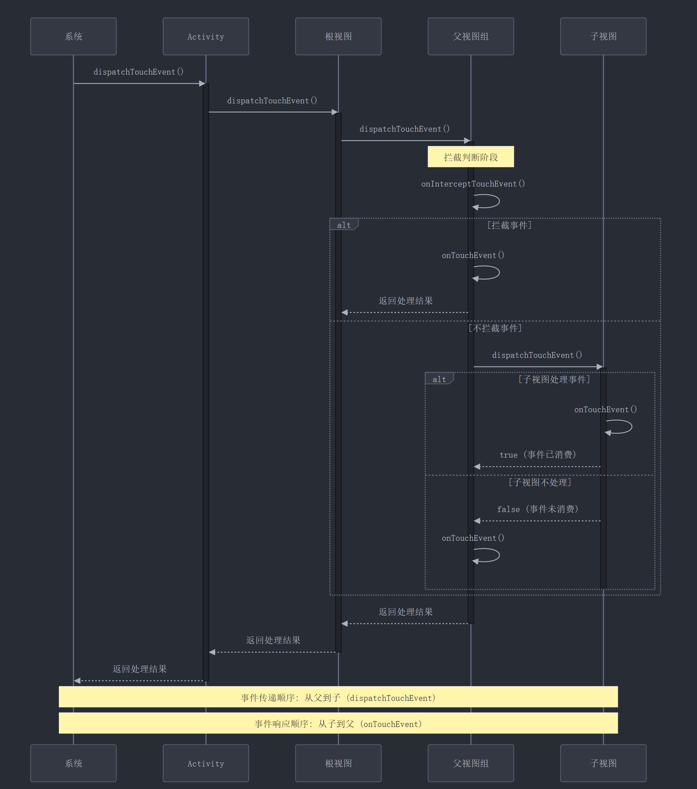

> 本文将从责任链模式的视角分析 Android 的触摸事件分发机制
## 1. 责任链模式
- 解耦发送者和接受者：请求的发送者不需要知道是哪个对象最终处理了请求
- 动态组合处理者：可以将多个处理对象连接成一条链
- 请求沿链传递：直到链上的某个对象处理它为止，或者达到链的末端
## 2. Android 触摸事件分发 --> [[责任链模式]]
- **请求**：`MotionEvent`对象。封装了关于触摸时间的所有信息
  - 类型：`ACTION_DOWN` `ACTION_MOVE` `ACTION_UP` `ACTION_CANCEL`
  - 坐标
  - 时间戳
  - 多点触控信息
- **处理者接口**：`View` 和 `ViewGroup` 类共同定义了处理触摸事件的契约和关键方法
  - `dispatchTouchEvent(MotionEvent ev)`：这是责任链中处理请求的核心方法。
    - 它接收事件，并负责决定是自己处理、传递给链上的下一个处理者（子 View），还是（对于 ViewGroup）先询问是否拦截。
  - `onInterceptTouchEvent(MotionEvent ev)` (仅 ViewGroup)：
    - 这是 `ViewGroup` 处理者特有的一个决策点。它在将事件传递给子处理者*之前*，判断自己是否要“拦截”这个请求并亲自处理。
  - `onTouchEvent(MotionEvent ev)`：这是处理者实际执行处理工作的地方。
    - 如果一个处理者决定处理该事件（因为它到达了目标 View，或者被 ViewGroup 拦截了），这个方法会被调用。
- **具体处理者 (Concrete Handler)**：
  - `Activity`：事件分发的起点。
  - `Window` (`PhoneWindow`)：`Activity` 将事件传递给它。
  - `DecorView`：`Window` 下的根 `ViewGroup`。
  - 各种 `ViewGroup` 子类（如 `LinearLayout`, `FrameLayout`, `RecyclerView`, `NestedScrollView`, 自定义 `ViewGroup`）：它们既可以处理事件，也可以将事件传递给它们的子 View，并且能决定是否拦截。
  - 各种 `View` 子类（如 `Button`, `TextView`, `ImageView`, 自定义 `View`）：它们通常是事件传递链的末端节点，负责最终处理事件。
- **链 (Chain)**：Android 的视图层级结构（View Hierarchy Tree）本身就构成了这条“链”。但与简单的线性链不同，它是一个树状结构。事件传递的路径是沿着这条树形链进行的。
  - **向下传递（主要链）**：通过 `dispatchTouchEvent` 从父节点到子节点。
  - **向上传递（处理/冒泡链）**：当 `onTouchEvent` 返回 `false` 时，事件处理的责任会“冒泡”给父节点的 `onTouchEvent`。
- {:height 928, :width 789}
-
